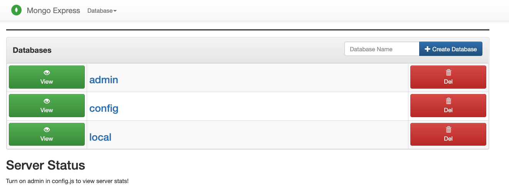

# Install MongoDB with Docker Compose

- mongodb를 docker compose를 통해서 설치하고 사용해보자. 
- docker compose로 2개의 서비스를 실행할 것이다. 
  - mongodb: mongodb 코어로 document base NoSQL이다. 
  - mongoexpress: mongodb와 연결하고, 관리할 수 있는 UI 인터페이스이다. 

## Docker Compose 파일 작성하기. 

- docker-compose를 통해서 mongodb를 실행하도록 docker-compose.yaml 파일을 다음과 같이 작성한다. 

```yaml
version: "3.8"
services:
    mongodb:
        image: mongo
        container_name: mongodb
        ports:
            - 27017:27017
        volumes:
            - data:/data
        environment:
            - MONGO_INITDB_ROOT_USERNAME=rootuser
            - MONGO_INITDB_ROOT_PASSWORD=rootpass
    mongo-express:
        image: mongo-express
        container_name: mongo-express
        restart: always
        ports:
            - 8081:8081
        environment:
            - ME_CONFIG_MONGODB_ADMINUSERNAME=rootuser
            - ME_CONFIG_MONGODB_ADMINPASSWORD=rootpass
            - ME_CONFIG_MONGODB_SERVER=mongodb
volumes:
    data: {}        

networks:
    default: 
        name: mongodb_network
```

- version: 3.8 
  - docker-compose 버젼을 나타낸다. 현재 최신 버젼은 3.8 이다. 
  - https://docs.docker.com/compose/compose-file/ 을 참조하자. 
- services: docker-compose로 올라올 서비스들을 나열한다. 
- services.mongodb: mongodb 서비스를 나타낸다. 
- services.mongodb.image: 설치할 mongodb를 나타내며 버젼이 없으니 최신 버젼으로 동작한다. 
- services.mongodb.container_name: 컨테이너 이름을 지정하였다. 여기서는 mongodb로 지정하였다. 
- services.mongodb.ports: mongodb의 포트는 27017이며 <호스트포트>:<컨테이너포트> 형식으로 지정하여 외부로 열어준다. 
- services.mongodb.volumes: mongodb 데이터가 저장될 볼륨을 지정한다. data 이름으로 참조되도록 저장한다.
- services.mongodb.environment: mongodb의 환경변수를 설정한다. 
  - MONGO_INITDB_ROOT_USERNAME: 루트 계정
  - MONGO_INITDB_ROOT_PASSWORD: 루트 비밀번호
- services.mongo-express: mongo-express 서비스를 나타낸다. 
- services.mongo-express.image: mongo-express 이미지를 나타낸다. 
- services.mongo-express.container_name: 컨테이너 이름으로 여기서는 mongo-express로 지정했다. 
- services.mongo-express.restart: always (서버가 내려가면 항상 재시동 하도록 작업한다.)
- services.mongo-express.ports: mongo-express 포트를 지정한다. <호스트포트>:<컨테이너포트> 형식으로 지정하여 외부로 열어준다. 
- services.mongo-express.environment: 환경변수를 지정한다. 
  - ME_CONFIG_MONGODB_ADMINUSERNAME: 관리자 아이디 
  - ME_CONFIG_MONGODB_ADMINPASSWORD: 관리자 비밀번호 
  - ME_CONFIG_MONGODB_SERVER: 연동할 mongodb 서버 이름을 지정한다. 
- volumens:     
  - data: {} : docker volume에 연동된다. 'docker volume ls' 로 확인이 가능하다. 
- networks: 네트워크 설정 
  - default: 기본 네트워크를 지정한다. 
    - name: 기본 네트워크 이름은 mongodb_network 이다. 

## 실행하기. 

- 우선 docker-compose.yaml 파일이 존재하는 디렉토리로 이동한다. 
  
```
docker-compose up -d
```

```
docker ps 

CONTAINER ID   IMAGE             COMMAND                  CREATED       STATUS       PORTS                               NAMES
d9793501e971   mongo             "docker-entrypoint.s…"   2 hours ago   Up 2 hours   0.0.0.0:27017->27017/tcp            mongodb
7e7b0ad839d4   mongo-express     "tini -- /docker-ent…"   2 hours ago   Up 2 hours   0.0.0.0:8081->8081/tcp              mongo-express
```

- 위와 같이 실행된 docker 컨테이너를 확인할 수 있다. 

## docker-express 에 접근하기. 

- http://localhost:8081 에 접속하면 다음과 같이 내용을 확인할 수 있다. 



- 위와 같이 접근이 가능하다. 

## mongo shell 이용하기. 

- mongo shell을 이용하기 위해서는 로컬에 mongodb를 설치하여 shell을 실행하는 방법이 있다. 
- 여기서는 docker 컨테이너에 접근하여 mongo shell을 실행해 보자. 

```
docker ps 

CONTAINER ID   IMAGE             COMMAND                  CREATED       STATUS       PORTS                               NAMES
d9793501e971   mongo             "docker-entrypoint.s…"   2 hours ago   Up 2 hours   0.0.0.0:27017->27017/tcp            mongodb
7e7b0ad839d4   mongo-express     "tini -- /docker-ent…"   2 hours ago   Up 2 hours   0.0.0.0:8081->8081/tcp              mongo-express
```

- 우리는 여기서 위 CONTAINER_ID d9793501e971 를 이용할 것이다. 

```
docker exec -it d9793501e971 /bin/bash
```

- 그리고 다음과 같이 mongo shell 명령을 수행한다. 

```
root@d9793501e971:/# mongo mongodb://localhost:27017 -u rootuser -p rootpass

MongoDB shell version v5.0.6
connecting to: mongodb://localhost:27017/?compressors=disabled&gssapiServiceName=mongodb
Implicit session: session { "id" : UUID("68ac0b3f-5528-4d4e-94fd-6c4994293987") }
MongoDB server version: 5.0.6
================
Warning: the "mongo" shell has been superseded by "mongosh",
which delivers improved usability and compatibility.The "mongo" shell has been deprecated and will be removed in
an upcoming release.
For installation instructions, see
https://docs.mongodb.com/mongodb-shell/install/
================
---
The server generated these startup warnings when booting: 
        2022-03-20T23:57:42.068+00:00: Using the XFS filesystem is strongly recommended with the WiredTiger storage engine. See http://dochub.mongodb.org/core/prodnotes-filesystem
---
---
        Enable MongoDB's free cloud-based monitoring service, which will then receive and display
        metrics about your deployment (disk utilization, CPU, operation statistics, etc).

        The monitoring data will be available on a MongoDB website with a unique URL accessible to you
        and anyone you share the URL with. MongoDB may use this information to make product
        improvements and to suggest MongoDB products and deployment options to you.

        To enable free monitoring, run the following command: db.enableFreeMonitoring()
        To permanently disable this reminder, run the following command: db.disableFreeMonitoring()
---
> 
```

## 데이터베이스 확인하고 사용하기.

### 데이터베이스 확인 

```
> show dbs;
admin   0.000GB
config  0.000GB
local   0.000GB
```

- 위에는 admin, config, local 3개의 데이터베이스가 있음을 알 수 있다. 
- mongodb에서 데이터베이스는 rdb에서 데이터베이스와 동일하다. 

### 데이터베이스 생성하기. 

```
> use kidodb;
switched to db kidodb

> db.kidodb.getName()
kidodb
```

- 방금 생성한 데이터베이스 이름을 확인할 수 있다. 

```
> show dbs;
admin   0.000GB
config  0.000GB
local   0.000GB
```

- 그러나 아직 dbs에는 내용을 확인할 수 없다. 

### collection 생성하기. 

```
> db.createCollection("hello");
{ "ok" : 1 }

> show dbs;
admin   0.000GB
config  0.000GB
kidodb  0.000GB
local   0.000GB
```

- db.crateCollection 을 통해서 컬렉션을 생성하였다. 
- mongodb에서 collection은 rdb에서 table에 해당한다. 
- 'show dbs;' 를 실행해보면 이제서야 kidodb 라는 데이터베이스가 생성되었다. 

### database 삭제하기. 

```

> db.dropDatabase()
{ "ok" : 1 }

> show dbs;
admin   0.000GB
config  0.000GB
local   0.000GB
```

- 정상으로 삭제가 되었다. 
- use kidodb 라고 사용해서 컨텍스가 이동되었기 때문에 현재 데이터베이스를 삭제하는 것이다. 
- 'show dbs;' 를 입력하면 정상적으로 데이터베이스가 삭제되었음을 알 수 있다. 

## 관련 명령어 살펴보기. 

```
> db.help()
DB methods:
    db.adminCommand(nameOrDocument) - switches to 'admin' db, and runs command [just calls db.runCommand(...)]
    db.aggregate([pipeline], {options}) - performs a collectionless aggregation on this database; returns a cursor
    db.auth(username, password)
    db.commandHelp(name) returns the help for the command
    db.createUser(userDocument)
    db.createView(name, viewOn, [{$operator: {...}}, ...], {viewOptions})
    db.currentOp() displays currently executing operations in the db
    db.dropDatabase(writeConcern)
    db.dropUser(username)
    db.eval() - deprecated
    db.fsyncLock() flush data to disk and lock server for backups
    db.fsyncUnlock() unlocks server following a db.fsyncLock()
    db.getCollection(cname) same as db['cname'] or db.cname
    db.getCollectionInfos([filter]) - returns a list that contains the names and options of the db's collections
    db.getCollectionNames()
    db.getLastError() - just returns the err msg string
    db.getLastErrorObj() - return full status object
    db.getLogComponents()
    db.getMongo() get the server connection object
    db.getMongo().setSecondaryOk() allow queries on a replication secondary server
    db.getName()
    db.getProfilingLevel() - deprecated
    db.getProfilingStatus() - returns if profiling is on and slow threshold
    db.getReplicationInfo()
    db.getSiblingDB(name) get the db at the same server as this one
    db.getWriteConcern() - returns the write concern used for any operations on this db, inherited from server object if set
    db.hostInfo() get details about the server's host
    db.isMaster() check replica primary status
    db.hello() check replica primary status
    db.killOp(opid) kills the current operation in the db
    db.listCommands() lists all the db commands
    db.loadServerScripts() loads all the scripts in db.system.js
    db.logout()
    db.printCollectionStats()
    db.printReplicationInfo()
    db.printShardingStatus()
    db.printSecondaryReplicationInfo()
    db.rotateCertificates(message) - rotates certificates, CRLs, and CA files and logs an optional message
    db.runCommand(cmdObj) run a database command.  if cmdObj is a string, turns it into {cmdObj: 1}
    db.serverStatus()
    db.setLogLevel(level,<component>)
    db.setProfilingLevel(level,slowms) 0=off 1=slow 2=all
    db.setVerboseShell(flag) display extra information in shell output
    db.setWriteConcern(<write concern doc>) - sets the write concern for writes to the db
    db.shutdownServer()
    db.stats()
    db.unsetWriteConcern(<write concern doc>) - unsets the write concern for writes to the db
    db.version() current version of the server
    db.watch() - opens a change stream cursor for a database to report on all  changes to its non-system collections.
> 
```

- 'db.help()' 를 입력하면 사용가능한 명령어들을 확인할 수 있다. 

## WrapUp

- 지금까지 로컬에서 간단하게 docker-compose를 이용하여 mongodb를 설치하였다. 
- mongo-express를 통해서 mongodb에 UI로 접근하는 방법도 확인하였다. 
- mongo-shell을 이용하여 mongodb에 접근하고, 간단하게 데이터베이스, 컬렉션을 생성하고 삭제도 해 보았다. 
